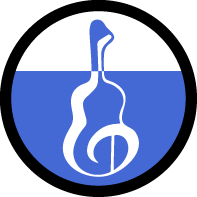

# dura

    

**让人痛哭流涕、老泪纵横的开发体验**

- 基于 [redux](https://github.com/reduxjs/redux) 插件化、可拔插 的前端数据流管理框架。

- 灵感来源于 [dva](https://github.com/dvajs/dva)、[mirror](https://github.com/mirrorjs/mirror)、[rematch](https://github.com/rematch/rematch)

- 遵循[Semantic Versioning 2.0.0](https://semver.org/lang/zh-CN/) 语义化版本规范。

- 不想写详细的文档，一切看 demo，本身也没太多复杂的功能

---

        如果项目不追求状态的可追溯性，同时React版本又可以即使的 升级，那么建议直接使用react-hooks会简单很多。
        react-hooks 的出现并不意味着 dura 将会被取代 。

---

 

## 文档

    本文假设你至少掌握redux ， 最好掌握dvajs

    我们遵循dvajs的model设计，在实际业务考量中，我们发现单纯的reducers事实上难以完成一个业务行为。

    因为我们大多数的业务都伴随着与服务端的交互，也就是说，我们一定会产生effects。

    在过去，我们尝试过 dvajs 框架，我们发现如果项目没有进行合适的领域划分，拆分成足够小的业务单元，

    那么项目成长的一定程度的时候将是灾难，因为 dispatch action 的type属性会让项目充斥着大量的魔鬼字符串，

    当然，你也可以说定义常量来解决这个问题，但是这样意味着我们需要额外产生大量的样板代码。

    至此，我们利用typescript与redux完美结合，产生了一些化学反应。

## 例子

- [example-pro](https://github.com/CN-YUANYU/dura/tree/master/packages/example-pro) 演示了 dura 全家桶的使用方式

**征集更过的基于 dura 的项目案例， 可直接提供在 issue 当中**

## 技术支持

